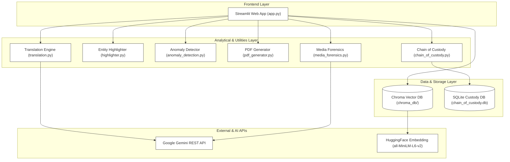

# 🕵️‍♂️ UFDR AI — Unified Forensic Data Retrieval and Analysis Assistant

**UFDR AI** (also known as **FORENSIS-AI**) is an advanced **AI-powered forensic intelligence system** designed to automate the triage and analysis of **Unified Forensic Data Reports (UFDRs)**. Built for **law enforcement**, **intelligence agencies**, and **forensic laboratories**, it transforms unstructured communications data into **actionable, explainable, and court-ready insights**.

---

## 🎯 The Problem Statement
Digital forensic investigations are bottlenecked by the sheer volume of mobile and chat dump files. A typical suspect device export contains tens of thousands of messages across WhatsApp, Signal, Telegram, and Discord, written in multiple languages and scattered with complex entity markers (crypto wallet hashes, phone numbers, transactional amounts). 

Currently, investigators must manually review these records or run basic keyword filters that miss semantic relationships, contextual anomalies, and multi-lingual conversations. UFDR AI solves this bottleneck by providing:
1.  **Semantic Search Indexing**: Vector search that understands user query intent (e.g. searching for "financial transactions" flags wire transfers, IBAN numbers, and crypto addresses without needing precise keyword matches).
2.  **Multilingual Entity-Preserving Translation**: Detects and translates foreign-language messages to English using Gemini, while keeping critical evidence markers (e.g. phone numbers and crypto addresses) unmodified.
3.  **Behavioral Intelligence Profile**: Automatically extracts patterns like high-volume spikes, odd-hour messaging (1-4 AM), relationship introductions, and sudden network drop-offs.
4.  **Cryptographic Chain of Custody**: Logs all analyst queries, uploads, and PDF reports in an append-only SQLite signature ledger to guarantee court-admissible audit trails.

---

## 🖼️ System Architecture
Below is a block diagram representing the layout, data flows, and external integrations of FORENSIS-AI. For a detailed breakdown of layers, review the [Architecture Documentation](docs/architecture.md) and [Database & Schema Reference](docs/schema.md).



---

## 🛠️ Technology Stack
*   **Web Dashboard (Frontend/UI)**: [Streamlit](https://streamlit.io/)
*   **Orchestration & Logic**: Python 3.12
*   **Semantic Search & Document Store**: [ChromaDB](https://www.trychroma.com/)
*   **Local Inference Embeddings**: HuggingFace SentenceTransformers (`all-MiniLM-L6-v2` generating 384-dimensional vector weights running locally on CPU)
*   **Large Language Models (LLM)**: Google Gemini API REST client integration (using `gemini-1.5-pro` and `gemini-1.5-pro-vision` for translation, suggestions, and vision tagging)
*   **Relational Datastore**: SQLite3 (for cryptographic action logs)
*   **Media Processing**: OpenCV-Python (`cv2`) for QR code extraction
*   **Visualizations**: `vis.js` CDN graph components (Timeline and Network modules embedded in Streamlit iframes)
*   **Document Generation**: ReportLab PDF library

---

## 🚀 Setup & Installation Instructions

Follow these steps to run the FORENSIS-AI application on your local machine:

### 1. Clone & Navigate to the Repository
Open your terminal (PowerShell, Command Prompt, or Bash) and navigate to the project directory:
```bash
cd d:/Coding/temp/UFDR-AI
```

### 2. Create a Virtual Environment
Create a clean isolated virtual environment to avoid package version conflicts:
```bash
python -m venv venv
```

### 3. Activate the Virtual Environment
*   **Windows (PowerShell)**:
    ```powershell
    .\venv\Scripts\Activate.ps1
    ```
*   **Windows (CMD)**:
    ```cmd
    .\venv\Scripts\activate.bat
    ```
*   **Linux / macOS (Bash)**:
    ```bash
    source venv/bin/activate
    ```

### 4. Install Project Dependencies
Install the required third-party Python packages using pip:
```bash
pip install -r requirements.txt
```

### 5. Configure API Credentials
Create an `.env` file inside the `Source/` directory:
```bash
# Source/.env
GEMINI_API_KEY="your_google_gemini_api_key_here"
```

### 6. Run the Application
Start the local Streamlit development server:
```bash
streamlit run Source/frontend/app.py
```
After starting, the server will open the visual dashboard in your default browser at `http://localhost:8501`.

---

## 🔮 Future Improvements Roadmap
*   **Media Tab Integration**: Integrate OpenCV QR code extraction and Gemini vision tagging directly into a unified "Media Analysis" view in the UI.
*   **Multi-Case Datastore**: Redesign ChromaDB initialization to persist multiple device exports concurrently, allowing cross-device and cross-case relationship mapping.
*   **User Access Controls (RBAC)**: Implement secure user login profiles and role-based clearance checks (e.g. Admin, Analyst, Auditor) to control ledger write permissions.
*   **GPU Ingestion Acceleration**: Optimize SentenceTransformer embedding generation to utilize CUDA-capable GPU hardware for rapid ingestion of large text exports.
*   **Advanced OCR**: Integrate Tesseract OCR capabilities alongside Gemini Vision to extract raw text content from screenshot attachments.
