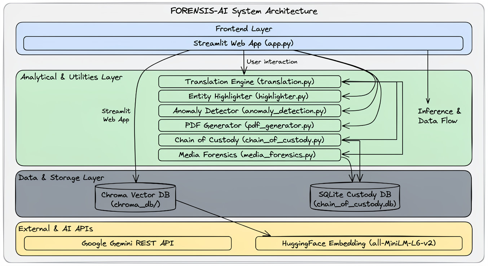

# FORENSIS-AI System Architecture

This document provides a detailed breakdown of the FORENSIS-AI digital forensics triage system, detailing its layered organization, database schemas, and request-response cycles.

---

## Architecture Diagram
Below is the block diagram showing the flow of data and execution paths across system boundaries:

---

## Architectural Layers

### 1. Frontend Layer
*   **Orchestrator**: [app.py](../Source/frontend/app.py)
*   **Technologies**: Streamlit (Python web framework)
*   **Responsibility**: 
    *   Manages user input panels (file uploads, search parameters, triggers).
    *   Controls session-level state variable storage (`st.session_state`).
    *   Embeds interactive visually-mappable graphs (vis.js Network and Timeline) inside HTML iframes.
    *   Presents verification status for the Chain of Custody ledger.

### 2. Ingestion & Search Layer
*   **Orchestrator**: [ingest.py](../Source/backend/ingest.py) and [search_engine.py](../Source/backend/search_engine.py)
*   **Responsibility**:
    *   Loads and parses forensic datasets (JSON, CSV formats).
    *   Maps different keys (`text`, `message`, `content`) to a normalized schema.
    *   Converts records into LangChain `Document` objects containing rich forensic metadata (sender, timestamp, channel, language).
    *   Invokes local sentence-transformers inference to load vectors into ChromaDB.
    *   Executes similarity searches using Cosine Distance against index embeddings.

### 3. Utilities Layer
Located under the `utils/` directory:
*   [translation.py](../utils/translation.py): Extracts critical entities (phone numbers, crypto addresses) into placeholders, translates the remaining text using Gemini API, and restores the entities to prevent address corruption.
*   [anomaly_detection.py](../utils/anomaly_detection.py): Implements statistical checks to identify time spikes and off-hour logs, compiling vis.js options for dynamic HTML views.
*   [highlighter.py](../utils/highlighter.py): Applies CSS-styled overlays to raw text containing crypto addresses, email addresses, monetary amounts, and URLs.
*   [pdf_generator.py](../utils/pdf_generator.py): Formats triaged matches, anomalies, and investigative suggestions into PDF files using the ReportLab canvas flow.
*   [chain_of_custody.py](../utils/chain_of_custody.py): Connects directly to SQLite to append HMAC-signed logs.
*   [media_forensics.py](../utils/media_forensics.py): Integrates OpenCV to search for QR codes and invokes Gemini Vision API to tag screenshots.

### 4. Database & Storage Layer
*   **ChromaDB Vector Store**: A local folder index situated at [Source/frontend/chroma_db](../Source/frontend/chroma_db). Stores text strings and their 384-dimensional vector representations.
*   **SQLite Ledger**: Located at `data/chain_of_custody.db`. Stores audit entries for every transaction, preserving hash links to past events to construct an append-only cryptographic chain.

---

## Core Lifecycles

### Ingestion Lifecycle
1.  **File Upload**: The user uploads a JSON report.
2.  **Schema Normalization**: Keys are mapped, and HTML tags are cleaned.
3.  **Language Check**: Non-English messages are translated to English (preserving numbers and addresses).
4.  **Local Vector Conversion**: HuggingFace converts normalized texts to vector embeddings.
5.  **Vector Store Persist**: ChromaDB stores documents and indexes vectors.
6.  **Ledger Logging**: A cryptographic log entry is appended to the SQLite chain of custody database.

### Search / Query Lifecycle
1.  **User Search**: The user enters a natural language query in the Streamlit search bar.
2.  **Semantic Search**: ChromaDB calculates distance matches for the query.
3.  **Deduplication**: Message entries are deduplicated by ID.
4.  **Entity Highlights**: Content matches are decorated with colored highlights.
5.  **Ledger Logging**: The search action, query string, and result count are appended to the chain of custody.
